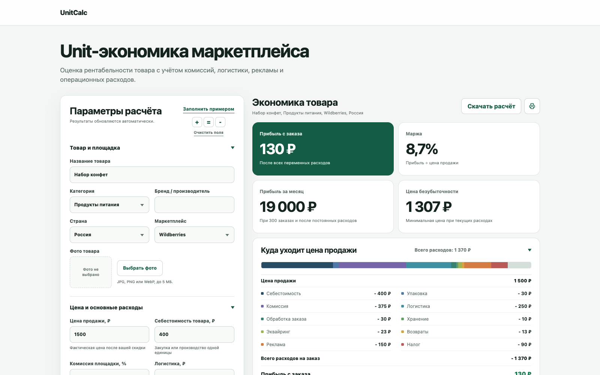
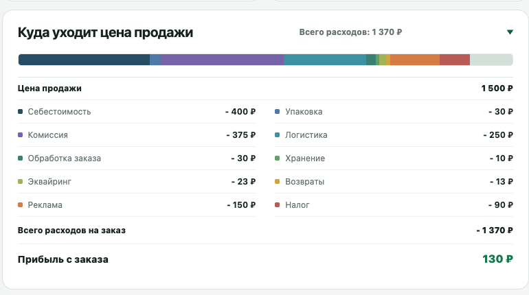
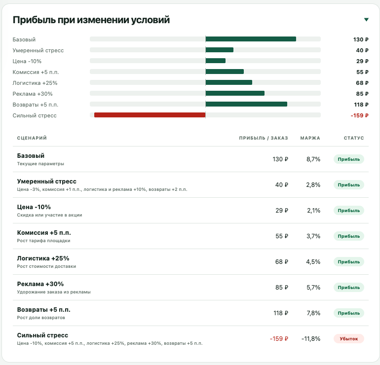

# UnitCalc


Бесплатный офлайн-калькулятор unit-экономики для продавцов на маркетплейсах. Он показывает не оборот, а финансовый результат одного выполненного заказа: сколько денег остаётся после себестоимости, комиссии, логистики, рекламы, налогов, возвратов и других расходов.



Инструмент работает как обычная HTML-страница, не требует регистрации, сервера или передачи данных. Его можно скачать, открыть локально либо опубликовать через GitHub Pages.

## Что умеет

- рассчитывать прибыль и маржу одного заказа;
- показывать полную структуру расходов без скрытых коэффициентов;
- находить цену безубыточности и допустимые расходы на рекламу;
- считать месячную прибыль с учётом постоянных расходов;
- определять количество заказов для покрытия постоянных расходов;
- сравнивать базовый расчёт с семью стресс-сценариями;
- ранжировать факторы по влиянию на прибыль;
- выгружать текстовый отчёт и печатную версию в PDF;
- сохранять в отчёте название, категорию, бренд, страну продаж и маркетплейс;
- заполнять форму случайным, прибыльным, пограничным или убыточным примером;
- добавлять локальное фото товара в печатную и PDF-версию без отправки файла в сеть.

## Интерфейс и результаты

### Структура расходов

Калькулятор показывает каждую статью затрат и сверяет их сумму с ценой продажи.



### Стресс-сценарии

Сравнение показывает, как скидки и рост отдельных расходов меняют прибыль и маржу заказа.



## Какие данные нужны

Для быстрого расчёта достаточно пяти значений:

1. цена продажи после скидки продавца;
2. себестоимость единицы товара;
3. комиссия площадки;
4. логистика одного выполненного заказа;
5. расходы на рекламу в расчёте на один заказ.

В дополнительном блоке можно учесть упаковку, обработку заказа, хранение, эквайринг, возвраты, налоги и прочие переменные расходы. Для месячного плана вводятся число заказов и постоянные расходы периода.

## Основная модель

```text
Ожидаемые расходы на возвраты =
Доля возвратов × Расход на один возврат

Переменные расходы =
Себестоимость + Упаковка + Комиссия + Логистика + Обработка
+ Хранение + Эквайринг + Возвраты + Реклама + Налог + Прочее

Прибыль с заказа = Цена продажи - Переменные расходы

Маржа = Прибыль с заказа ÷ Цена продажи × 100%

Прибыль за месяц =
Прибыль с заказа × Заказы в месяц - Постоянные расходы
```

Комиссия, эквайринг и налог рассчитываются как процент от цены продажи. Возвраты считаются через ожидаемую стоимость: например, при доле возвратов 5% и расходе 250 ₽ на один возврат средний расход на каждый заказ равен 12,50 ₽.

Подробное описание допущений и формул находится в [docs/METHODOLOGY.md](docs/METHODOLOGY.md).

## Как запустить

Сборка и внешние библиотеки не нужны. Можно просто открыть `index.html` в браузере.

Для запуска через локальный веб-сервер:

```bash
npm start
```

После этого откройте [http://localhost:8080](http://localhost:8080).

## Тесты

Требуется Node.js 18 или новее.

```bash
npm test
```

Автоматические тесты проверяют все ключевые формулы, месячный план, стресс-сценарии, диагностику результата и валидацию входных данных.

## Структура

```text
index.html                 интерфейс калькулятора
src/calculator.js          независимое расчётное ядро
src/app.js                 отображение результатов и экспорт
src/styles.css             адаптивные стили и печатная версия
tests/calculator.test.js   автоматические тесты модели
docs/METHODOLOGY.md        формулы, определения и ограничения
```

## Ограничения

UnitCalc не загружает тарифы маркетплейсов автоматически и не прогнозирует спрос. Условия зависят от площадки, категории, схемы работы, склада, региона и договора продавца, поэтому пользователь вводит фактические ставки из своего кабинета. Перед решением о запуске следует проверить актуальные тарифы, налоговый режим и реальные расходы на тестовой партии.

## Происхождение проекта

Первая версия модели появилась в практических расчётах по оценке выхода производителя на маркетплейсы. Для публичного инструмента модель была переработана: узкоспециальные обозначения, CAC и предположения о повторных покупках удалены из основного расчёта, а вместо них добавлена прозрачная unit-экономика одного заказа, полный состав затрат и месячный план.

## Стек

HTML, CSS, JavaScript, Node.js Test Runner. Проект не использует фреймворки и внешние зависимости.

## Лицензия

MIT.
